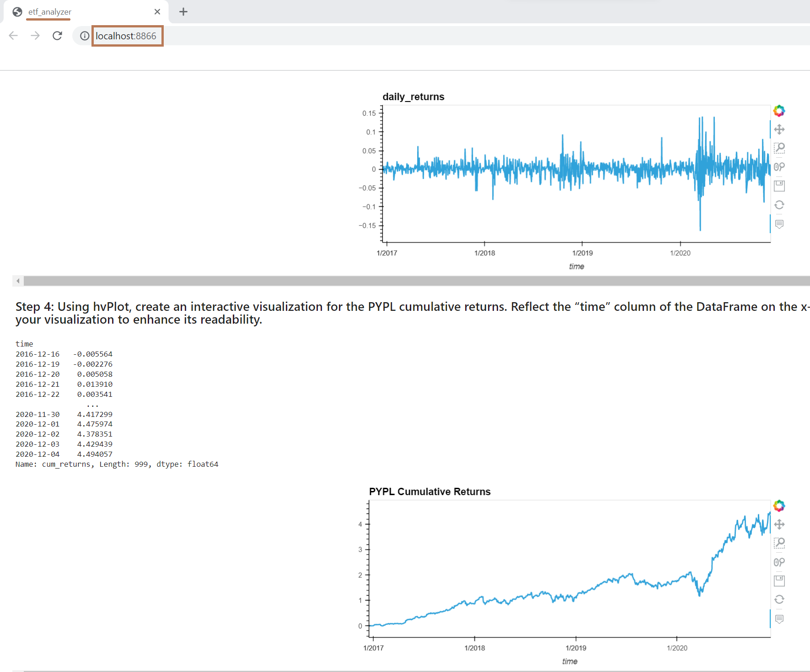

# Etf Analyzer

This project entails building a financial database and web application to analyze the performance of a hypothetical fintech ETF.

In this case, we analyze an ETF consisting of four stocks (GOST, GS, PYPL, SQ) in four different steps: 

* Analysis of each single asset in the ETF
* Optimization of data access with Advanced SQL queries
* Analysis of the ETF portfolio
* Deployment of the notebook as a we application

---

## Technologies

The whole project is implemented in Python, writen in Jupyter lab using the Numpy and Pandas libraries for calculations and hvplot for plotting: 

* ```import pandas as pd```
* ```import numpy as np```
* ```import hvplot.pandas```

In this case we also use SQL queries to optimize data access and the Voilà library to deploy the visualizations to a web application:

* ```import sqlalchemy```

For the Voilà library and final web deployment we have followed these steps:

* Install Voilà: In the terminal, run ```pip install voila``` to install the Voilà library.

* Convert the Jupyter Notebook to a Voilà application: Open the Jupyter notebook you want to deploy, and then in a cell, run the following command: ```!voila .ipynb```.

* Deploy the Voilà application locally: Run the following command in your terminal: voila .ipynb. This will start a local server and display the Voilà web application in the browser.

The main ```etf_analyzer.ipynb``` file reads via SQL from the database-```etf.db```- contained in the folder.

---

## Usage

Run the main ```etf_analyzer.ipynb``` in Jupyter Lab. 

In the **first part**, we analyze the daily returns of one of the stocks (PYPL). We first extract the data with a SQL query, then analyze the Pandas DataFrame and finally plot the daily and cumulative returns for the period considered:


**Secondly**, we refine the query by filtering the datapoints where prices have been above a certain level, and also which days have registered the highest dayly_returns: 


**Third**, we join all the individual stocks data tables by using SQL joins, and we average the daily_returns (by assuming that this ETF contains equally weighted returns). Then we analyze the annualized Portfolio returns and plot the cumulative returns using hvplot:


**Finally**, we use the command ```!voila .ipynb``` in the Jupyter Notebook to deploy it locally as a wed:



Note that it also works running from the console:


---

## Contributors

Feature developed by Lourdes Dominguez [(LinkedIn profile)](https://www.linkedin.com/in/lourdes-dominguez-bengoa-12333044/)

---

## License

Use only for academic purposes.